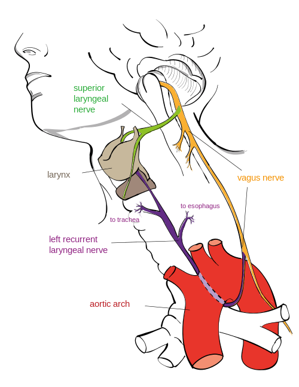

## Organisms by Means of Natural Selection

A common misconception with evolution comes from the phrase "survival of the fittest". It doesn't mean the fastest or the strongest organism. It's not about it's fitness on the race track, it's about it's ability to fit in to it's environment. Whilst some adaptations seem extremely fine tuned, a closer look reveals that organisms have bizarre features and traits. For example the __[recurrent laryngeal nerve](https://en.wikipedia.org/wiki/Recurrent_laryngeal_nerve)__.

[Image by Jkwchui - Creative Commons Attribution-Share Alike 3.0 Unported]

The recurrent laryngeal nerve, branches off from the vagus nerve that sprouts out of the back of a head. Instead of branching off and going directly to the larynx (the voice box), it takes a tour down to the chest, loops under the aortic arch and travels back up to the larynx. This _could_ sprout out earlier and take a direct route to the larynx, but it doesn't. 

In fact it's true for the the [Giraffe too](https://en.wikipedia.org/wiki/Giraffe#Internal_systems).

[Steve Garvie - Attribution-Share Alike 2.0 Generic]

Instead of being a direct 2 inches in length, it's over several feet. No engineer would ever design a system like that...right? So why is it there? History and legacy. 

In our fish-like ancestors the brain, the gills and heart were close together. It was more direct for the laryngeal-equivalent nerve to go from the brain to the gills. But over time, gradually, as the biology of the fish turned in to the biology of a mammal and the neck began to evolve the heart went in to the chest and the laryngeal nerve got "trapped". There was no reason for the nerve to "jump" from one side of the aortic arch to the other. So when it comes to modern day animals, there's no way that their going to spontaneously loose this trait. There's too much legacy genetics.

However if modern futuristic super hero (or super villain) genetic engineers were to design a new giraffe with a short, direct laryngeal nerve, it could be a monumental task. As they tweak one gene, other things may get switched on or off, say the development of the eyes or an extra pair of [nipples](http://en.wikipedia.org/wiki/Supernumerary_nipple)! They may get it to jump over the aortic arch but it still may be several feet in length. And that may be good enough before resources run out.

The main take away is that external constraints can cause natural or artificial selection to produce seemingly-illogical design decisions. It's illogical to a modern day engineer, but when you take in the genetic cost to re-write things it just wouldn't happen. In fact it's perfectly reasonable __why__ it is the way it is when you take in to consideration the cost and other environmental factors.

## Computers and Software by Means of Environmental Selection

Over the course of a career in computer programming you come across bizarre, obscene and down right insecure code. In fact you don't need to be a developer to hear the latest reports on how the Internet or some device is broken.

The Internet, its protocols, infrastructure and the devices connected to it are good _enough_ to survive in the environment. If it weren't they wouldn't be here. They're fast _enough_, cheap _enough_, secure _enough_, enough to survive and even thrive.

There's a mix of devices and software out there, for different environments or markets. For the consumer, for the enterprise and for the state. Each with their own constraints on resources, legacy and history.

Every computer program written on a modern operating system is just a veneer of a [dizzying spiral of complexity](https://plus.google.com/+JeanBaptisteQueru/posts/dfydM2Cnepe) where so many things could go wrong. Each part with so many weaknesses or attack vectors.

These were created by error, lack of time or budget, by poor design or even because of the laws of physics.

Systems, like organisms, can often have glaring problems that can be trivially scoffed at but the cost of creating something that works in all scenarios, in all environments, is easy to use, cheap, is 100% secure and maintainable is unrealistic. 

## Conclusion

We may get frustrated with patches and updates every time we switch on our device of choice or start our game but there's so much that could go wrong! It's everything to do with the environmental pressures in which the computer, phone, operating system or piece of software arises from and how that environment is in constant flux.

A complete rewrite of the anscestry of your computer hardware or software is unlikely to happen!

[Image by Jkwchui - Creative Commons Attribution-Share Alike 3.0 Unported]: https://en.wikipedia.org/wiki/File:Recurrent_laryngeal_nerve.svg
[Steve Garvie - Attribution-Share Alike 2.0 Generic]: https://en.wikipedia.org/wiki/File:Flickr_-_Rainbirder_-_Reticulated_Giraffe_drinking.jpg